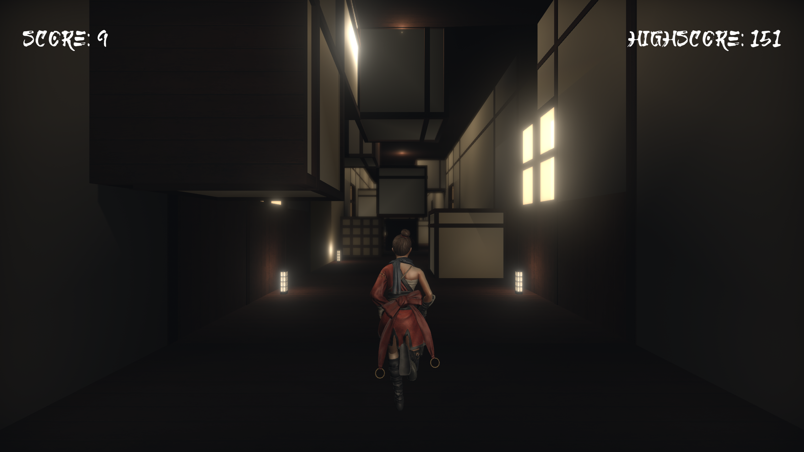

# Infinity Corridor

This is a 3D endless running game (with a small twist) developed in Unity. The traditional japanese theme is inspired by the set [Infinity Castle](https://kimetsu-no-yaiba.fandom.com/wiki/Infinity_Castle) from the anime Demon Slayer.

## Gameplay

https://user-images.githubusercontent.com/77313916/191864933-23331cdb-32e4-4431-bb22-547d41b81a52.mp4

The basic gameplay is to use the left and right arrow keys to dodge obstacles. But player can also switch the gravity direction by holding shift and pressing the arrow keys. This is sometimes necessary to dodge the obstacles.

There are three main obstacles to avoid:
* Static obstacles that are fixed in the scene
* Dynamic obstacles that will move with the gravity
* Windows that players will fall through if stepped on 

Player can acquire the invisible mask which will give the player another chance when colliding with an obstacle.

## Acknowledgements

* Character and animations are from [Mixamo](https://www.mixamo.com/#/)
* Music: Warrior by yoitrax | https://soundcloud.com/yoitrax
* Japanese Lamp Asset by https://sketchfab.com/Aki_Kato 
* Japanese Mask Asset by https://sketchfab.com/dammne 

